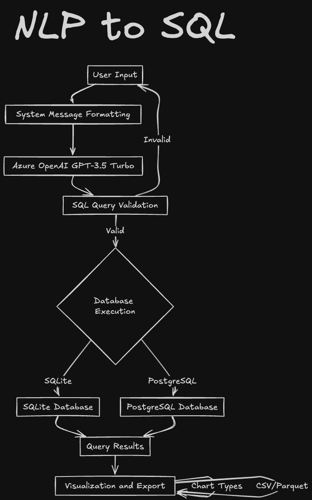

# NLP2SQL

NLP2SQL is a project that aims to generate SQL queries from natural language text. The system converts natural language inputs into semantically correct SQL queries, enabling dynamic database handling, data visualization, and interactive querying.

## 🧐 Features

- **Natural Language to SQL**: Converts text-based user queries into SQL commands using Azure OpenAI.
- **Multi-Database Support**: Connects and operates with SQLite and PostgreSQL databases.
- **Interactive Data Explorer**: Allows filtering and analysis of query results within an interactive data table.
- **Dynamic Schema Representation**: Retrieves and displays database schemas, with options to select tables for queries.
- **Custom Visualizations**: Offers a variety of chart types for visualizing query results.
- **Visualization Suggestion:** Recommend the most suitable visualization type based on the query output, and include a ⭐️ icon beside the suggestion for better emphasis.
- **Summary Statistics**: Displays numeric and categorical data insights for query results.
- **Decision Log and Query Path Summary**: Provides a detailed log of the query generation process, including error handling and decision-making insights.
- **Export Options**: Supports exporting query results in multiple formats.
- **Query History**: Saves and revisits past queries for easy future access.
- **Safe SQL Execution**: Validates SQL queries to prevent harmful commands and SQL injection.
- **PostgreSQL Connection Configuration**: Allows configuration of connection details for PostgreSQL databases.
- **Error Handling and Retry Mechanism**: Implements robust error handling and retries for generating SQL queries, ensuring reliability even with complex inputs.
- **Enhanced Visualization Options**: Includes dynamic suggestions for visualization types and interactive chart configuration in the sidebar.
- **Advanced Data Handling**: Features like data type conversion for date columns and handling of duplicate column names in query results.
- **Interactive Query History**: Provides a searchable and paginated query history with options to re-run past queries.

## 🛠️ Installation Steps

1. **Clone the Repository:**

   ```bash
   git clone https://github.com/lohitkolluri/NLP2SQL.git
   cd NLP2SQL
   ```

2. **Set Up Environment Variables:**
   Create a `.env` file in the root directory with the following variables:

   ```env
   OPENAI_API_KEY="Your Azure OpenAI API Key"
   OPENAI_ENDPOINT="https://name_of_openai_resource.openai.azure.com/"
   OPENAI_API_VERSION="API Version"
   MODEL_NAME="Name of Your Model from Azure OpenAI"
   ```

3. **Install Dependencies:**

   ```bash
   pip install -r requirements.txt
   ```

4. **Database Setup:**

   - **SQLite**: Ensure you have SQLite installed and accessible.
   - **PostgreSQL**: Install PostgreSQL and configure your database settings in the db selector dropdown.

5. **Running the App:**

   ```bash
   streamlit run NLP2SQL.py
   ```

6. **Access the App:**
   Open your web browser and go to:
   ```
   http://localhost:8501
   ```

## 💻 Built With

- **Streamlit**: Powers the interactive web application.
- **Altair**: Renders dynamic and customizable data visualizations.
- **Pandas**: Provides robust data manipulation tools.
- **SQLite & PostgreSQL**: Enables multi-database connectivity and support.
- **Azure OpenAI**: Translates natural language queries into SQL commands.

## 🚀 Additional Features

- **Custom CSS Styling**: Enhances interface aesthetics and user experience with tailored CSS.
- **Schema Explorer**: Displays the database schema to guide query formulation.
- **Database File Upload**: Allows users to upload SQLite database files directly for querying.
- **Collapsible Query History**: Saves query history in a collapsible section for easy access and re-running of queries.
- **Dynamic Query Generation**: Manages ambiguous queries effectively, with decision logs explaining interpretation paths.

## 📝 How It Works

The application processes natural language queries, converting them into SQL commands to interact with connected databases. Key functionalities include:

- **Loading Database Schemas**: Automatically retrieves and displays schemas, allowing users to select tables for querying.
- **Query Generation and Validation**: Generates SQL queries with safety checks to prevent destructive commands.
- **Data Visualization**: Creates rich visual representations of data with a range of chart options, powered by Altair.
- **Exporting Results**: Allows users to download query results in multiple formats.
- **Interactive Elements**: Utilizes Streamlit components for a responsive and intuitive user experience.

This application is designed to simplify data interaction, enabling users to explore and visualize their databases effortlessly.

## 🖼️ Diagram

<p align="center">
    
</p>
