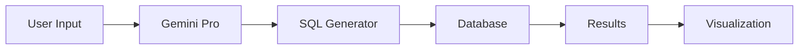
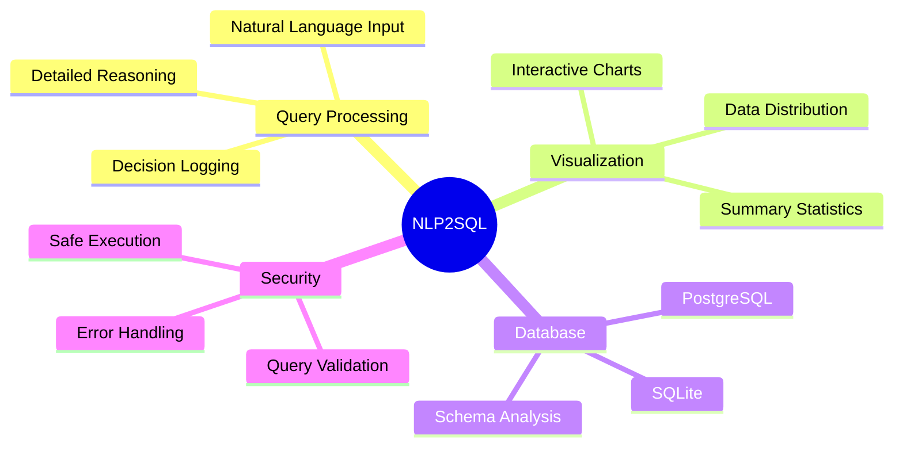

# NLP2SQL 🤖

<div align="center">

[](https://deepmind.google/technologies/gemini/)
[](https://streamlit.io)
[](https://www.postgresql.org/)

> 🎯 Transform natural language into powerful SQL queries with ease!

</div>

<p align="center">
 Turn your words into SQL magic
 Visualize your data dynamically
 Multi-database support
</p>

## ✨ Features

<details>
<summary>🎯 Core Features</summary>

- **Natural Language to SQL** 🗣️ → 📝
  - Convert text queries into SQL commands using Google's Gemini Pro model
  - Intelligent query interpretation with detailed decision logs
  - Step-by-step reasoning for query generation
- **Multi-Database Support** 🗄️
  - SQLite compatibility with file upload
  - PostgreSQL integration with secure connection
  - Dynamic schema exploration
- **Interactive Data Explorer** 🔍
  - Real-time data filtering and exploration
  - Comprehensive query results with summary statistics
  - Advanced table views with sorting and filtering

</details>

<details>
<summary>📊 Visualization & Analytics</summary>

- **Dynamic Visualizations** 📈
  - Multiple chart types (Bar, Line, Scatter, Area, Histogram)
  - Interactive chart configuration
  - AI-powered visualization recommendations
- **Summary Statistics** 📋
  - Detailed numeric analysis
  - Categorical data insights
  - Distribution analysis
  - Statistical measures (mean, median, mode, skewness, kurtosis)

</details>

<details>
<summary>🛡️ Security & Management</summary>

- **Safe SQL Execution** 🔒
  - Strict query validation
  - SQL injection prevention
  - Comprehensive error handling and feedback
- **Query History** 📚
  - Searchable query log
  - Query reusability
  - Multiple export formats (CSV, Excel, JSON)

</details>

## 🚀 Getting Started



### Installation

1️⃣ **Clone the Repository**

```bash
git clone https://github.com/yourusername/NLP2SQL.git
cd NLP2SQL
```

2️⃣ **Set Up Environment**

```bash
# Create .env file
cat << EOF > .env
GEMINI_API_KEY = "Your Google Gemini API Key"
GEMINI_MODEL = "Name of Gemini Model You Will be usin"
EOF
```

3️⃣ **Install Dependencies**

```bash
pip install -r requirements.txt
```

4️⃣ **Launch the App**

```bash
streamlit run app/NLP2SQL.py
```

## 🎨 Built With

<div align="center">

|                                             Technology                                              |    Purpose     |
| :-------------------------------------------------------------------------------------------------: | :------------: |
|         | Web Interface  |
|  | NLP Processing |
|      |    Database    |
|                              | Visualizations |

</div>

## 🌟 Key Features



## 💡 How It Works

1. **Query Input** ➡️ User enters natural language query
2. **Processing** ➡️ Gemini Pro analyzes and generates SQL with reasoning
3. **Validation** ➡️ Query is validated for safety and correctness
4. **Execution** ➡️ Query runs against selected database
5. **Analysis** ➡️ Results are processed with summary statistics
6. **Visualization** ➡️ Data is presented with AI-recommended charts
7. **Export** ➡️ Results can be downloaded in multiple formats

## 📊 Supported Visualizations

- **Bar Chart**: Comparing categorical data
- **Line Chart**: Time-series and trend analysis
- **Scatter Plot**: Relationship between variables
- **Area Chart**: Cumulative totals and trends
- **Histogram**: Distribution analysis

## 🔒 Security Features

- Strict SQL query validation
- Prevention of harmful SQL operations
- Secure database connections
- Protected sensitive information
- Input sanitization

## 📈 Data Analysis

- Comprehensive summary statistics
- Distribution analysis
- Correlation detection
- Trend identification
- Outlier detection

<div align="center">

</div>
