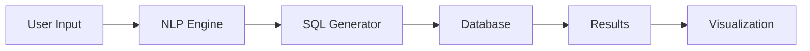
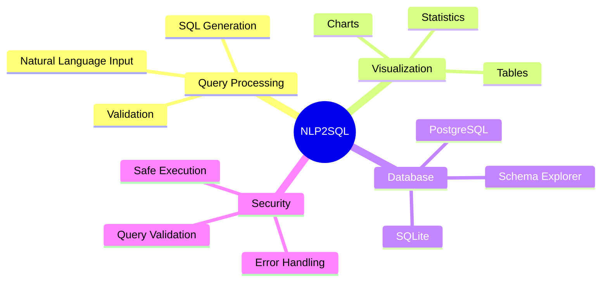

# NLP2SQL 🤖

<div align="center">

[](https://azure.microsoft.com/products/cognitive-services/openai-service/)
[](https://streamlit.io)
[](https://www.postgresql.org/)

> 🎯 Transform natural language into powerful SQL queries with ease!

</div>

<p align="center">
 Turn your words into SQL magic
 Visualize your data dynamically
 Multi-database support
</p>

## ✨ Features

<details>
<summary>🎯 Core Features</summary>

- **Natural Language to SQL** 🗣️ → 📝
  - Convert text queries into SQL commands using Azure OpenAI
  - Intelligent query interpretation and generation
  
- **Multi-Database Support** 🗄️
  - SQLite compatibility
  - PostgreSQL integration
  - Dynamic database switching
  
- **Interactive Data Explorer** 🔍
  - Real-time data filtering
  - Interactive query results
  - Dynamic table views

</details>

<details>
<summary>📊 Visualization & Analytics</summary>

- **Dynamic Visualizations** 📈
  - Multiple chart types
  - Interactive configurations
  - Smart visualization suggestions ⭐️
  
- **Summary Statistics** 📋
  - Numeric data insights
  - Categorical analysis
  - Trend identification

</details>

<details>
<summary>🛡️ Security & Management</summary>

- **Safe SQL Execution** 🔒
  - Query validation
  - SQL injection prevention
  - Error handling
  
- **Query History** 📚
  - Searchable log
  - Re-runnable queries
  - Export capabilities

</details>

## 🚀 Getting Started




### Installation

1️⃣ **Clone the Repository**
```bash
git clone https://github.com/lohitkolluri/NLP2SQL.git
cd NLP2SQL
```

2️⃣ **Set Up Environment**
```bash
# Create .env file
cat << EOF > .env
OPENAI_API_KEY="Your Azure OpenAI API Key"
OPENAI_ENDPOINT="https://name_of_openai_resource.openai.azure.com/"
OPENAI_API_VERSION="API Version"
MODEL_NAME="Name of Your Model from Azure OpenAI"
EOF
```

3️⃣ **Install Dependencies**
```bash
pip install -r requirements.txt
```

4️⃣ **Launch the App**
```bash
streamlit run NLP2SQL.py
```

## 🎨 Built With

<div align="center">

| Technology | Purpose |
|:-----------:|:--------:|
|  | Web Interface |
|  | NLP Processing |
|  | Database |
|  | Visualizations |

</div>

## 🌟 Key Features



## 💡 How It Works

1. **Query Input** ➡️ User enters natural language query
2. **Processing** ➡️ Azure OpenAI translates to SQL
3. **Execution** ➡️ Query runs against selected database
4. **Visualization** ➡️ Results displayed with appropriate charts
5. **Export** ➡️ Download results in preferred format

<div align="center">

### 🌟 Start Exploring Your Data Today! 
---
</div>
